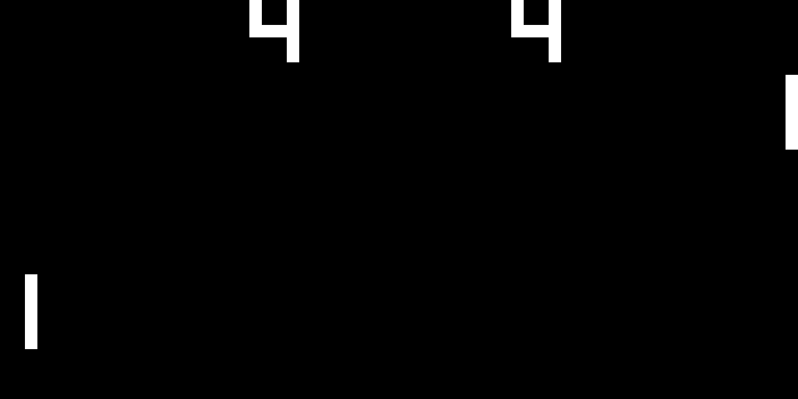
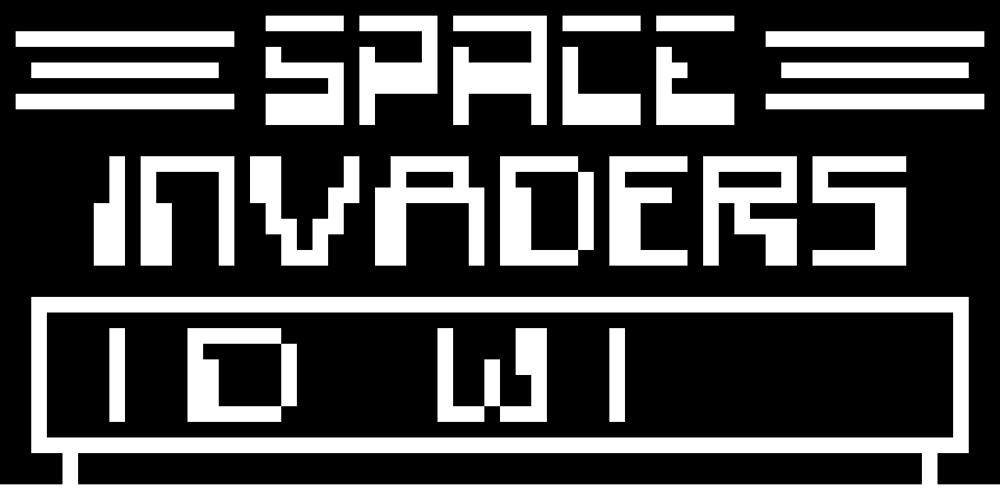

# chip-8-emulator

This is a Chip-8-emulator.

I followed this guide in order to make it: [Building a CHIP-8 Emulator [C&#43;&#43;] - Austin Morlan](https://austinmorlan.com/posts/chip8_emulator/)

The files [Platform.cpp](src/Platform.cpp), [Platform.h](src/Platform.h) and [main.cpp](src/main.cpp) are basically a copy and paste from the guide (except for some minor changes that I have done in order to make them work with the rest of the project).

Other resources I found useful:

- [CHIP-8 - Wikipedia](https://en.wikipedia.org/wiki/CHIP-8)

- [How to write an emulator (CHIP-8 interpreter) | Multigesture.net](https://multigesture.net/articles/how-to-write-an-emulator-chip-8-interpreter/)

- [codeslinger.co.uk](http://www.codeslinger.co.uk/pages/projects/chip8.html)

For the opcodes I used the table from the Wikipedia page as a reference: [CHIP-8 - Wikipedia](https://en.wikipedia.org/wiki/CHIP-8#Opcode_table)

## Installation

See [INSTALL.md](INSTALL.md)

## Execution

If you are not inside the build folder do:

```shell
cd build
```

To run the executable:

```shell
./chip8 <scale> <delay> <ROM>
```

where:

- <scale> represents the scale of the window

- <delay> represents the speed of the game

- <ROM> represents the file of the game to be loaded

For example, let's suppose that there is a ROM called Pong.ch8 (**.ch8** is the extension of the ROMs for the Chip-8) inside the root directory of the project. If we are currently inside the build folder, the command would be:

```shell
./chip8 20 1 ../Pong.ch8
```

## Download ROMs

You can download Chip-8 ROMs from this [here](https://github.com/dmatlack/chip8/tree/master/roms/games).

## Images






